# Udacity-Cloud-DevOps-Capstone

> Udacity Cloud DevOps Capstone project. In this project, I applied my skills and knowledge which was developed throughout the Cloud DevOps Nanodegree program.

> I created a CI/CD pipeline for a basic website that deploys to a cluster in AWS EKS which is Blue/Green Deployment.


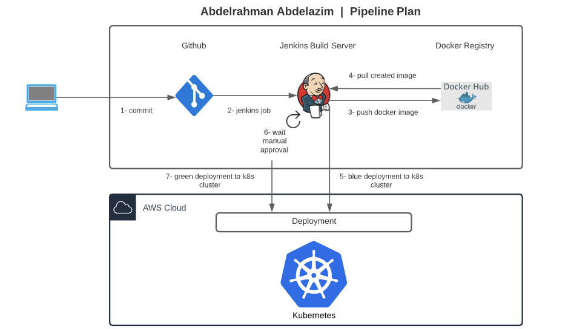


## Prerequisites:

* AWS account
* Jenkins
* Docker
* Pip
* AWS Cli
* Eksctl
* Kubectl

<hr>

## Objectives

- Working in AWS
- Using Jenkins to implement Continuous Integration and Continuous Deployment
- Building pipelines
- Working with eksctl and CloudFormation to deploy clusters
- Building Kubernetes clusters
- Building Docker containers in pipelines

<hr>

## Tools Used

- Git & GitHub
- AWS & AWS-CLI
- Tidy
- Docker & Docker-Hub Registery
- Jenkins
- Kubernetes CLI (kubectl)
- EKS
- Eksctl
- CloudFormation
- BASH
- LucidChart

<hr>

## Project Steps

1. [Development](#development)
2. [Jenkins](#jenkins)
3. [Setup Kubernetes Cluster](#setup-kubernetes-cluster)
4. [CI/CD Pipeline](#ci/cd-pipeline)

<hr>

### Development

- Simple HTML Website

- **Docker Containerization (Local manual check):**

    Run docker flask-app container:

    ```
        $./run_docker.sh
    ```

<br>

- **Push docker image to docker-hub (Local manual check):**

    ```
        $./upload_docker.sh
    ```
<hr>

### Jenkins

- **Create security-group for jenkins:**

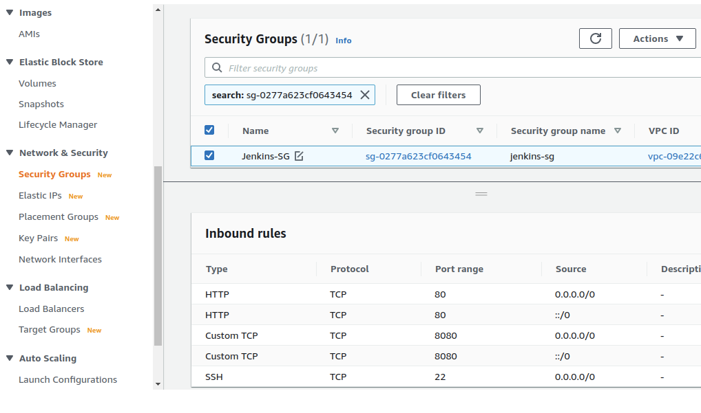

- **Create jenkins EC2:**

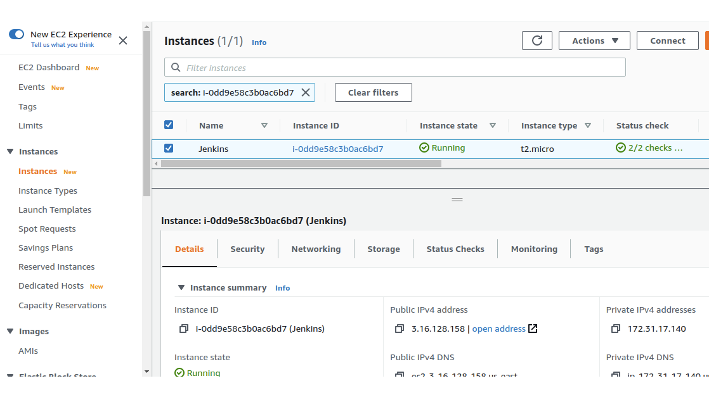

- **Install Jenkins On Ubuntu:**
    - Install java:

        ```
        $ sudo apt update 
        $ sudo apt upgrade
        $ sudo apt install default-jdk
        ```

    - Install Jenkins.
        ```
        $ wget -q -O - https://pkg.jenkins.io/debian/jenkins.io.key | sudo apt-key add -
        $ sudo sh -c 'echo deb http://pkg.jenkins.io/debian-stable binary/ > /etc/apt/sources.list.d/jenkins.list'
        $ sudo apt update
        $ sudo apt install jenkins
        $ sudo systemctl status jenkins
        ```

    - Setup Jenkins:
        1. Visit Jenkins on its default port: http://your_server_ip_or_domain:8080.
        2. Next you will see the "Unlock Jenkins" screen, displaying the location of the initial password.
        ```
        $ sudo cat /var/lib/jenkins/secrets/initialAdminPassword
        ```
        3. Installing recommended plugins.
        4. Create the admin user and make note of both the user and password to use in the future.

    - Install "Blue-Ocean-Aggregator" Plugin.

    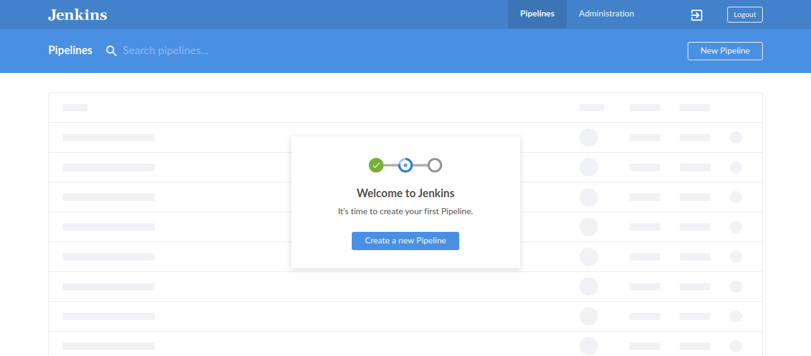


- **Docker With Jenkins:**

    - Install docker on jenkins server.

    - Add jenkins to docker group:
        ```
        $ sudo usermod -aG docker jenkins
        ```

    - Install "Docker" jenkin's plugin.

    - Add Docker-Hub credentials to jenkins.

    - Use docker plugin to build, upload, and delete docker images.

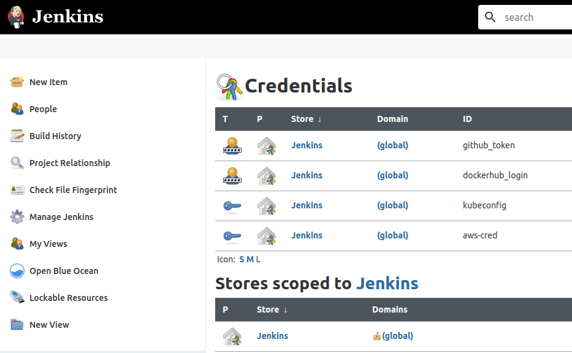

- **AWS With Jenkins:**

    - Install "Pipeline-AWS" Plug-In.
    - Add AWS-User credentials to jenkins.
    

- **Kubernetes With Jenkins:**

    - Install kubectl.

<hr>

### Setup Kubernetes Cluster

Create kubernetes "Production" Cluster on AWS using EKS:

#### Bring up Our Cluster:

- Creating the cluster:
```
eksctl create cluster -f eks-cluster/eks-capstone-cluster.yaml
```

- Check the cluster:
```
eksctl get cluster --region us-east-2
```

<hr>

### CI/CD Pipeline

Steps:

1. Linting Code:

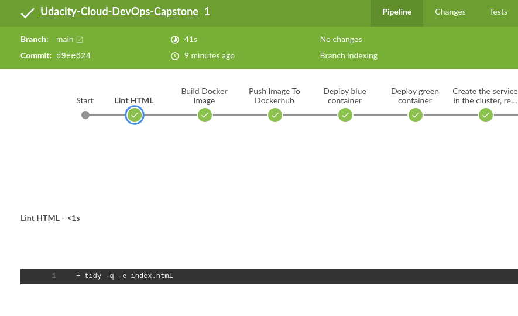


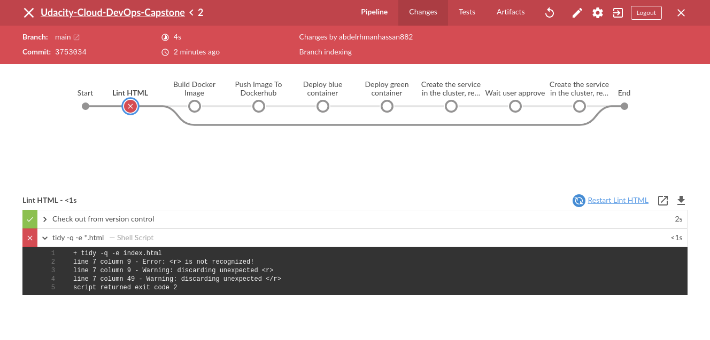

2. Build Docker Image

3. Push Docker Image (abdelrahman16/capstone) to docker-hub registry:

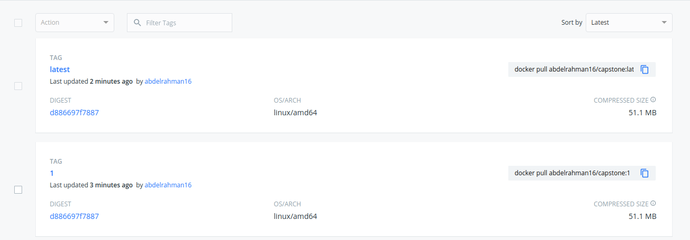

4. Blue Deployment:

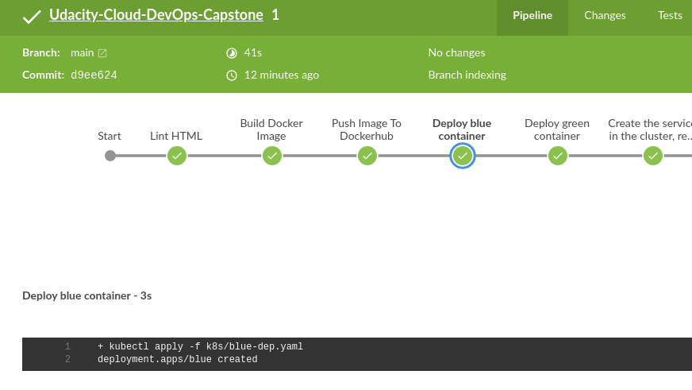

5. Manual Approval:

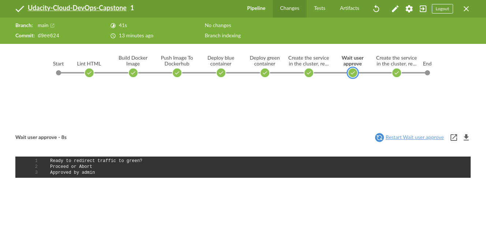

6. Green Deployment

<hr>

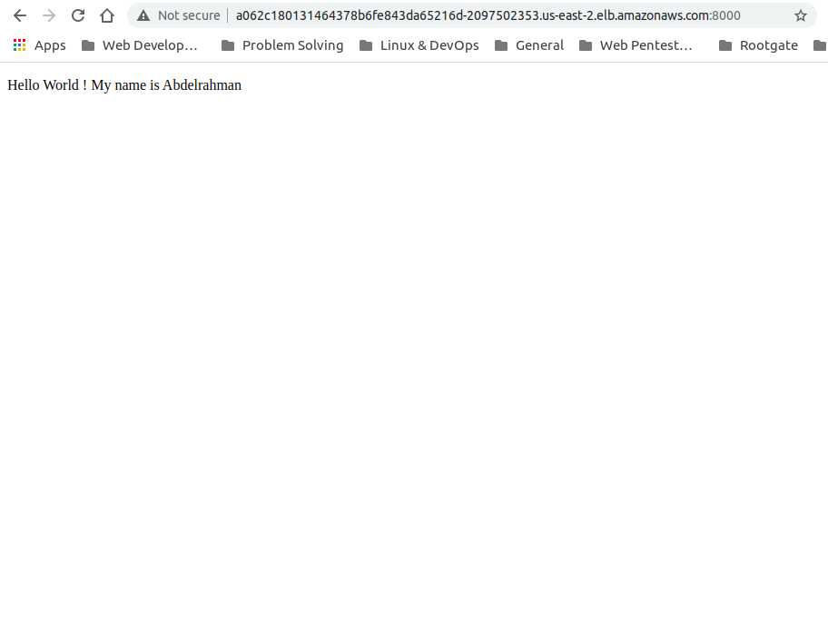


